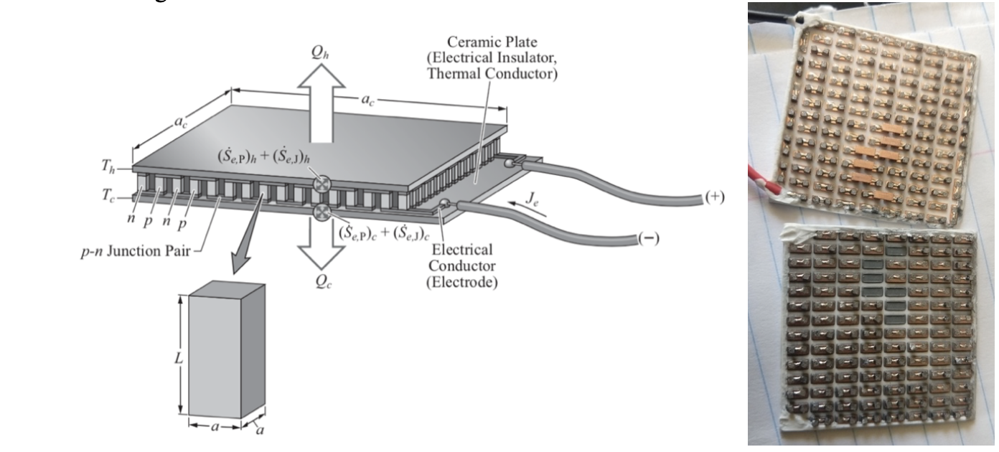

# ME450 - BLUElab Bangladesh Thermoelectric Cooling Project 

## Notes from the Co-Founder of BLUElab Bangladesh
During my college days, I had the preveilege of co-founding a multidisciplinary design team with the goal of engineering solutions to provide thermal comfort to the urban slums residents in Dhaka, Bangladesh. In the first 2 years of its inception, the team has been focused on choosing the most suitable partner Non-Governmental Organization (NGO) and finding out what the most pressing needs in the urban slum community were. Subsequently, I developed this project further with a separate group of mechanical engineering students for my final year project, in hope of coming up with a feasible solution. 

This is a repository containing the matlab code simulating the hot side and cold side temperature of thermoelectric cooler with heat sinks attached to both sides to determine effects on outlet air temperature, using key heat transfer equations. Please refer to Pg 22 - 32 of the final report for more detailed analysis of the thermoelectric cooling calculations. 

[Kaviany, M. “Heat Transfer Physics”. Cambridge University Press, 2014.]

## References
**Final Report:** ME450_Team8_Final_Report.pdf

