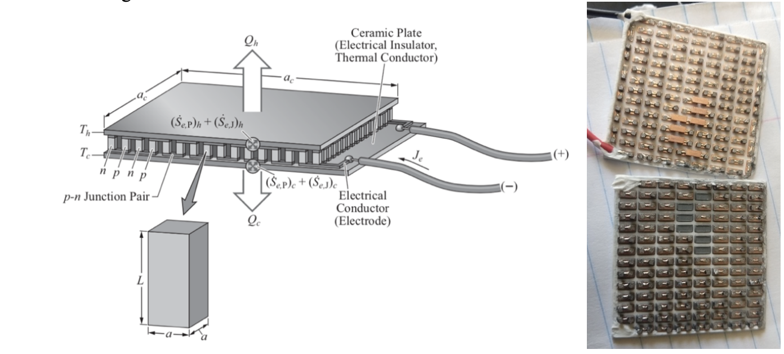
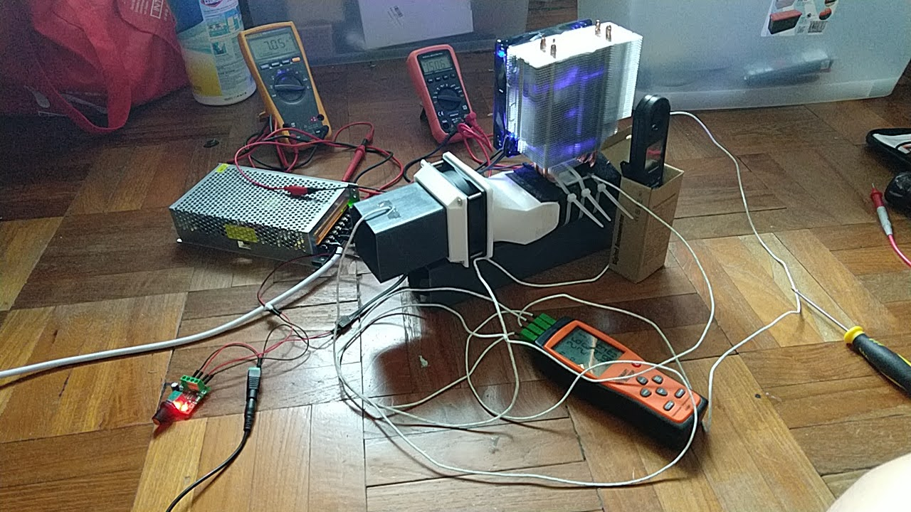

# BLUElab Bangladesh Thermoelectric Cooling Project 

## Notes from the Co-Founder of BLUElab Bangladesh
During my college days in the University of Michigan - Ann Arbor, I had the preveilege of co-founding a multidisciplinary design team alongside a few passionate students, namely Tasin Malik, Rumi Deb, Raisa Faatimah and Abrar Iqbal. Our primary goal was to come up withs engineering solutions to provide thermal comfort to the urban slums residents in Dhaka, Bangladesh. In the first 2 years of its inception, the team has been focused on choosing the most suitable partner Non-Governmental Organization (Spreeha Foundation) and finding out what the most pressing needs in the urban slum community were. Subsequently, I developed this project further with a separate group of mechanical engineering students for my final year project (ME450), in hope of coming up with a feasible prototype. 

This is a repository containing the matlab code simulating the hot side and cold side temperature of thermoelectric cooler with heat sinks attached to both sides to determine effects on outlet air temperature, using key heat transfer equations. Please refer to Pg 22 - 32 of the final report for more detailed analysis of the thermoelectric cooling calculations. 

## Intructions
All matlab code can be found in the subfolders within the `cooler_project_bangladesh` folder. These subfolders serve the following purposes: 
1. **input_current_analysis**: Investigates the effects of different input current on Power Consumption and Cooling Power on airstream for **1 thermoelectric cooling element**. 
2. **series_input_current_analysis**: Investigates the effects of different input current on Power Consumption and Cooling Power on airstream for **2 or more thermoelectric cooling elements arranged in series to airflow** (Change the `num_modules_series` variable to specify quantity of cooling elements).
3. **parallel_input_current_analysis**: Investigates the effects of different input current on Power Consumption and Cooling Power on airstream for **2 or more thermoelectric cooling elements arranged in parallel to airflow** (Change the `num_modules_parallel` variable to specify quantity of cooling elements).
4. **fin_dimension_analysis**: Studies the changes in overall cooling power of thermoelectric system with fin dimensions on hot and cold side for **1 thermoelectric cooling element**.
5. **comparison_model_vs_testing**: Compares matlab model with data from real-life prototype testing to validate matlab model. 
6. **cooling_power_against_delta_t_curve_validation**: Parameter identification of thermoelectric chip parameters for matlab model by comparing cooling performance of thermoelectric chip in simulation vs performance provided by specification sheets. 

## Final Capstone Presentation
Please **click on the image below** to view the youtube video of the final presentation.

## Experimentation
The image below is a breakdown of a single thermoelectric chip. Given engineering analysis performed using the matlab simulation, I proceeded with setting up a simple test rig that would serve to validate this matlab simulation. Once validated, this model could be used as a guide towards the final design of the thermoelectric cooler that would meet the specified requirements. 

[Kaviany, M. “Heat Transfer Physics”. Cambridge University Press, 2014.]  

## Special Thanks
This project was made possible with the help of peers, subject matter experts, and faculty members at the University of Michigan. Firstly, I would like to extend my gratitude to **Spreeha Foundation** for welcoming us into their community and believing in the potential of youths in making a difference. I would first like to thank the **BLUELab team** for their tireless effort in making this project a success thus far. I would also like to thank the **ME450 team** comprised of talented mechanical engineers who helped with the conception of the thermoelectric cooler idea. **Professor Steven Skerlos,** a ME professor who is also the advisor for the Center for Socially Engaged Design, provided the team with invaluable insights and helped us navigate through tough partnership dilemma. **Charlie Michaels**, associate director for the Center for Socially Engaged Design, who accompanied the team during the partnership evaluation trip and provided continuous feedback to the BLUElab team through the years. I want to thank our faculty advisor, **Professor Massoud Kaviany**, for his guidance and support for this project from start to finish. His expertise in heat transfer analysis, positive encouragement, and feedback was crucial to this design experience, and we owe our success to him. Last but not least, I want to thank the **Engineering Honors department** for motivating us students to do our very best in our time in college.

## References
**Codebase:** `cooler_project_bangladesh` folder 
**Final Report:** `ME450_Team8_Final_Report.pdf` file
